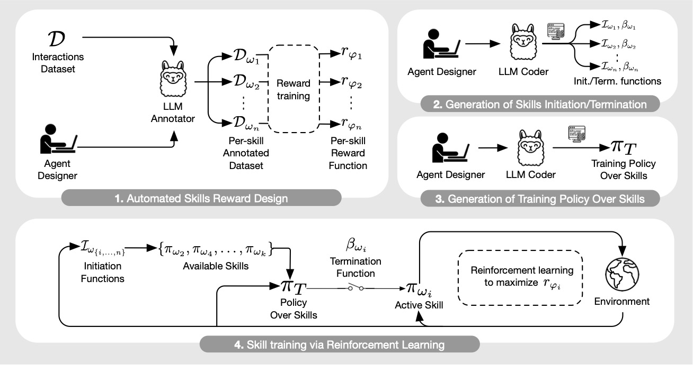
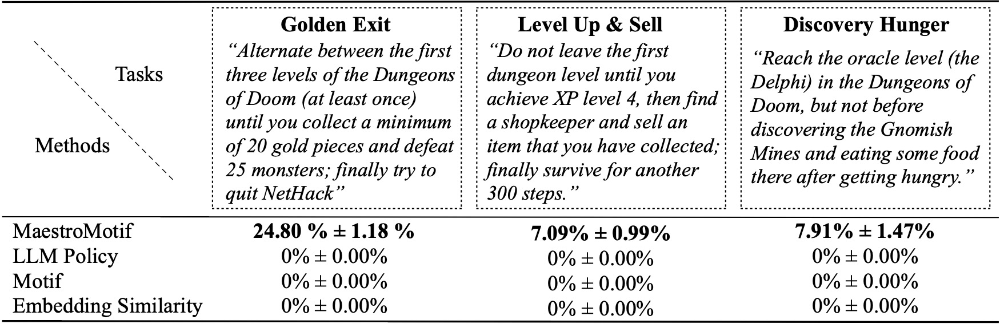

# Overview
This repository contains PyTorch code for MaestroMotif, a method for AI-assisted skill design to perform zero-shot control, guided by natural language prompts.

**[MaestroMotif: Skill Design from Artificial Intelligence Feedback](https://arxiv.org/abs/2412.08542)**

by the authors: [Martin Klissarov](https://mklissa.github.io/),  [Mikael Henaff](https://www.mikaelhenaff.com/), [Roberta Raileanu](https://rraileanu.github.io/), [Shagun Sodhani](https://shagunsodhani.com/),  [Pascal Vincent](https://mila.quebec/en/person/pascal-vincent/), [Amy Zhang](https://amyzhang.github.io/), [Pierre-Luc Bacon](https://pierrelucbacon.com/), [Doina Precup](https://doinaprecup.github.io), [Marlos C. Machado](https://webdocs.cs.ualberta.ca/~machado/)* ,  [Pierluca D'Oro](https://proceduralia.github.io/)* 


<p align="center">
    
</p>

As illustrated in the figure below, MaestroMotif learns skills from four phases:
1. **Skill Reward Design**: use an LLM's preferences on pairs of observations to create an annotated dataset of pairs and  train a reward function with it ;
2. **Generation of Initation/Termination Functions**: query an LLM to generate code representing the initation function and termination function for the skills;
3. **Generation of Training Policy Over Skills**: query an LLM to generate code for the policy over skills;
4. **Skill Training via Reinforcement Learning**: train a single skill-conditioned policy to achieve the intended behaviour for each skills.


<p align="center">
    
</p>


Once the skills are learned, MaestroMotif recomposes them, _zero-shot_, through a prompt describing the task of interest. Some of these prompts are shown below.


<p align="center">
    
</p>


We instantiate MaestroMotif on the challenging, open-ended and procedurally generated NetHack game through the [NetHack Learning Environment](https://github.com/heiner/nle), where it outclasses all studied baselines.

As shown on the [BALROG](https://balrogai.com) benchmark, NetHack remains an incredibly difficult challenge, with current best LLMs achieving near zero success rate.

To install the required dependencies for the whole pipeline, simply run `pip install -r requirements.txt` and `bash setup_nethack.sh`.

## Evaluation
For convenience, we include pretrained weights of the skill-condition policy. 

To evaluate MaestroMotif on one of tasks presented in the paper, run the following command.

```
python -m scripts.main --algo APPO --num_workers 24 --num_envs_per_worker 20 \
                       --batch_size 4096 --reward_scale 0.1 --obs_scale 255.0 \
                       --train_for_env_steps 5_000_000_000 --save_every_steps 6_000_000_000 \
                       --code_seed 42 --seed 2  --stats_avg 1000
                       --train_dir train_dir/skill_policy/ --experiment default \
                       --reward_dir "['train_dir/skill_rewards/llama3_discoverer_default',
                                      'train_dir/skill_rewards/llama3_descender_default',
                                      'train_dir/skill_rewards/llama3_ascender_default',
                                      'train_dir/skill_rewards/llama3_worshipper_default',
                                      'train_dir/skill_rewards/llama3_merchant_default']"
                         --evaluation True --eval_target goldenexit 
```
where `eval_target` represents the target tasks being evaluated. Taken from Table 1 in the paper, potential target tasks consist of navigation tasks (`gnomish`, `delphi`, `minetown`) and interaction-based tasks (`transactions`, `price`, `buc`). 

Additionally, MaestroMotif can be run on composite tasks, shown in the Table above, which consist of `goldenexit`, `levelupsell` and `discoveryhunger`.


## Skill Reward Design
For the first phase, we use a dataset of pairs of observations collected by agents
trained with reinforcement learning to maximize the game score as well as observations human gameplay sampled from [Dungeon and Data](https://github.com/facebookresearch/nle/blob/main/DATASET.md). 
We provide the dataset in this repository in the `og_dataset/` folder where for each skill we have a `{skill}.pkl` containing the sampled transitions. We also provide for convenience the preferences elicited by the Llama 3.1 70b in the `preference/` directory following the format `llama3_{skill}_default.npy`.

To annotate the datasets from scratch, the `scripts.annotate_pairs` sccript is available. It assumes that the dataset will be annotated in different chunks using the `n-annotation-chunks` argument. This allows for a process that can be parallelized depending on the availability of resources, and is robust to restarts/preemption. To run with a single chunk (i.e., to process the entire dataset), and annotate with the default prompt template and task specification, run the following command.

```
python -m scripts.annotate_pairs --directory og_dataset \
                                 --goal_key discoverer \
                                 --n-annotation-chunks 1 \
                                 --chunk-number 0
```

Where `goal_key` specifies the skill being annotated. Note that the default behavior resumes the annotation process by appending the annotations to the file specifying the configuration, unless otherwise indicated with the `--ignore-existing 1` flag. The name of the '.npy' file that is created for the annotations can also be manually selected by using the `--custom-annotator-string` flag. 

Next, we distill the LLM's preferences into a reward function through cross-entropy. To launch the reward training with default hyperparameters, use the following command.

```
python -m scripts.train_reward  --batch_size 1000 --num_workers 40  \
        --reward_lr 1e-5 --num_epochs 20 --seed 777 \
        --dataset_dir og_dataset --experiment llama3_descender_default \
        --train_dir train_dir/skill_rewards
```

The reward function will be trained through the annotations that are located in `--dataset_dir` . The resulting function will then be saved in `train_dir` under the sub-folder `--experiment`.

## Generation of Initation/Termination Functions and Policy over Skills

Both the generation of code representing the skill initiation/termination functions and the policy over skills is done through in-context learning. These procedures are done with the scripts contained in the `code_generation` folder. For each task, run the following command.
```
python hf_llama.py
```
where the code generation is done through the Llama 3.1 405b model served by the HuggingFace API. The script is convenient written if you want to experiment with models from other companies. After the generation of the policy over skills, this should be combined with the code for the initiation function and termination function with the following command.

```
python combine.py
```
The code should then be put in `rl_baseline/meta_policies`. We provide such generations in the repository. 

In the case of the composite tasks, the policy over skills will generate methods that leverage additional attribute, such as the agent's current experience level. When the LLM defines such attributes, it is afterwards queried to write code for these attributes such that their values are gathered from the environment.

## Skill Training via RL 

Finally, the elements generated in the previous phases are combined to train the skill policies via RL. Following the call-and-return paradigm, the training policy  decides which skill to execute among the ones deemed as available by the initiation functions. Then, the skill-conditioned policy gets executed in the environment and trained to maximize its corresponding reward function until its termination function deactivates it. Initialized randomly at the beginning of the process, each skill policy will end up approximating the behaviors originally specified in natural language.

To train the skill-conditioned policy from scratch, you can use the following command.

```
python -m scripts.main --algo APPO  --num_workers 24 --num_envs_per_worker 20 \
                       --batch_size 4096 --reward_scale 0.1 --obs_scale 255.0 \
                       --train_for_env_steps 4_000_000_000 --save_every_steps 50_000_000 \
                       --keep_checkpoints 5 --stats_avg 1000 --seed 2 --code_seed 42  \
                       --reward_dir "['train_dir/skill_rewards/llama3_discoverer_default',
                                      'train_dir/skill_rewards/llama3_descender_default',
                                      'train_dir/skill_rewards/llama3_ascender_default',
                                      'train_dir/skill_rewards/llama3_worshipper_default',
                                      'train_dir/skill_rewards/llama3_merchant_default']"
                       --extrinsic_reward 0.0 --llm_reward 0.1
                       --train_dir train_dir/skill_policy/
                       --experiment default
```

## Citation
If you build on our work or find it useful, please cite it using the following bibtex.

```
@article{klissarov2024maestromotifskilldesignartificial,
      title={MaestroMotif: Skill Design from Artificial Intelligence Feedback}, 
      author={Martin Klissarov and Mikael Henaff and Roberta Raileanu and Shagun Sodhani and Pascal Vincent and Amy Zhang and Pierre-Luc Bacon and Doina Precup and Marlos C. Machado and Pierluca D'Oro},
booktitle={The Thirteenth International Conference on Learning Representations},
year={2025},
url={https://openreview.net/forum?id=or8mMhmyRV}

}
```

## License

The majority of Motif is licensed under CC-BY-NC, however portions of the project are available under separate license terms: sample-factory is licensed under the MIT license.
